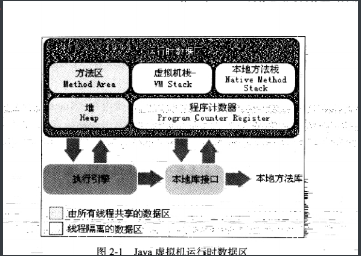

# java虚拟机

java虚拟机平台可以运行非java语言编写的程序,jvm只关注字节码文件

jvm是最强大的虚拟机

虚拟机分为系统虚拟机,和程序虚拟机.

jvm是程序虚拟机,是为执行单个计算机程序而设计的.是一台执行java字节码的

特点

一次编译,到处运行

自动内存管理

自动垃圾回收功能

jvm整体架构

Java编译器输入指令流基本上是一种基于栈的指令集架构,另一种是基于寄存器的指令架构.

栈的指令集架构特点:

1. 设计实现简单,适用于源受限的系统
2. 避开寄存器分配难题,只用零地址指令方式分配.
3. 指令流大部分是零地址的指令,过程操作依赖于操作栈,指令集更小,编译器易执行.
4. 不需要硬件支持,可移植性好,可以更好的实现跨平台.

寄存器的指令集架构特点:

1. 依赖硬件,移植性差
2. 性能优秀执行高效
3. 花费更少的指令去完成操作
4. 大部分情况,基于寄存器架构的指令集都是一地址指令,二地址指令和三地址指令为主.

## java虚拟机的生命周期

虚拟机的启动

启动是通过引导类的加载器.创建一个初始类.来完成的.这个类是由虚拟机的具体实现指定的.也就是main方法.所在的类.

虚拟机的执行

jps 查看当前程序中的进程.

执行一个java程序的时候,真正执行的是一个java虚拟机的进程.

虚拟机的退出

1. 正常执行结束
2. 程序执行异常,或者错误而终止
3. 操作系统错误,导致java虚拟机进程终止
4. 线程调用Runtime 类或者System类,的exit方法,或者halt方法.
5. jni(java native interface ) 可以用api来加载或者卸载java虚拟机

## jvm 发展历程

classic vm

是第一款商用java虚拟机,该虚拟机只提供解释器, 当外挂jit的时候不能使用解释器

jit 及时编译器,会将程序中经常使用的代码编译程及其指令,也教方法区的缓存代码,不需要代码逐行执行.

exact vm

exact memory management 准确式内存管理

具备热点探测..编译器和解释器混合工作模式

只支持solaris平台.

hotspot vm

jdk1.3之后就是默认的虚拟机,有热点代码探测技术.移动端,服务端,桌面端,嵌入式端都有应用.

jrockit 专注服务器端

因为不关注程序启动时间,所以不包含解析器实现,全部都有编译器编译执行.

是最快的jvm,

j9 有影响力的三大商用虚拟机之一,接近于hotspot 

# 类加载子系统

作用

负责从文件系统,网络加载class文件,class文件有特定的开头文件标识.

classloader只加载,不负责运行,运行是执行引擎决定.

加载类的信息放在方法区的内存空间中,方法区还会方运行时常量池信息.

javap -v hello.class 进行反编译文件

classloader的作用.

 

将本地的class文件,加载到jvm中,被称为dna元数据模板,放在方法区.

在.class文件->jvm->最终成为元数据模板,这个过程需要类加载器来进行传输.

类的加载过程

加载

1. 通过类的全限定名获取定义此类的二进制流.
2. 将字节流转化成方法区的运行时数据结构
3. 内存中生成一个class对象,作为方法区这个类的各种数据的访问入口.

链接

1. 验证
   1. 确保字节流的正确性,不危害虚拟机,验证包括,文件格式验证,数据员验证,字节码验证.符号引用验证.
2. 准备
   1. 分配内存,设置变量默认值
   2. 不包含final修饰的static ,final是编译时候分配,
   3. 不分配实例变量的初始化,类变量分配在方法区,实例变量分配在java堆中.
3. 解析
   1. 常量池中符号进行直接转化

初始化

1. 初始花就是执行类构造器方法< clinit >() 过程.
2. 不需要定义,是编译器自动手机类变量的复制动作以及静态代码块中的语句合并而来.
3. 按照语句的执行顺序来执行.
4. < clinit > () 不同于类的构造器.( 构造器是虚拟机中的< init >() 方法 )
5. 该类有父类,就会先执行父类的< clinit > () 
6. 同一个类< clinit > ()  在多线程下会被同步加锁.
7. 在静态代码块后面声明的变量,可以赋值,但不能调用.(报错:非法的向前引用)

类加载器的分类

jvm支持两种类型的类加载器: 引导类加载器(bootstrap classloader)和自定义类加载器(user-defined classloader)

所有派生于抽象类classloader的类的加载器都是自定义加载器.

引导类加载器(bootstrap classloader)是c++实现的

自定义类加载器(user-defined classloader)java实现的

虚拟机自带的加载器

启动类加载器

1. c/c++实现,加载java核心库提供jvm自身需要的类
2. 不继承classloader 没有父加载器
3. 是加载扩展类,和应用程序类加载器的父类加载器
4. 只加载包名为java,javax.sun 等开头的类.

扩展类加载器

1. java编写,派生于classloader类,父类为启动类加载器
2. 从java.ext.dirs系统属性指定目录加载类库.或者在jdk目录下的jre/lib/ext 

应用程序类加载器

1. Java编写父类是扩展类加载器,负责将环境变量或者Java.class.path路径下的类库加载
2. 是程序默认的类加载器,一般的Java应用的类都是她加载
3. ClassLoader#getSystemClassLoader()可以获得类加载器

用户自定义类的加载器

为什么要自定义类加载器

1. 隔离加载类,不同框架加载,如果是相同类路径,为了避免冲突进行隔离
2. 修改类的加载方式
3. 扩展加载源
4. 防止源码泄露.

获取classloader的途径

1. clazz.getclassloader() 获取当前类的classloader
2. Thread.currentThread().getContextClassLoader()
3. ClassLoader.getSystemClassLoader()
4. 获取调用者的classloader  Drivermanger.getCallerClassLoader()

双亲委派机制

1. 一个类加载器收到类加载的请求不会先加载,会先委派给自己的父类执行
2. 如果父类存在父类,继续委托,直到启动类加载器
3. 如果父类可以加载,就加载并返回完成,如果不能加载,就让子类尝试加载,这就是双亲委派机制

优势

1. 避免类重复加载
2. 保护核心api被随意篡改

沙箱安全机制

保证Java核心源代码的安全,这就是沙箱安全机制

类加载器的引用

如果一个类是用户类加载器加载,jvm会将这个类加载器的一个引用作为类型信息的一部分保存在方法区,当解析一个类型到另一个类型的引用的时候,jvm需要保证这两个类型的类加载器是相同的.

