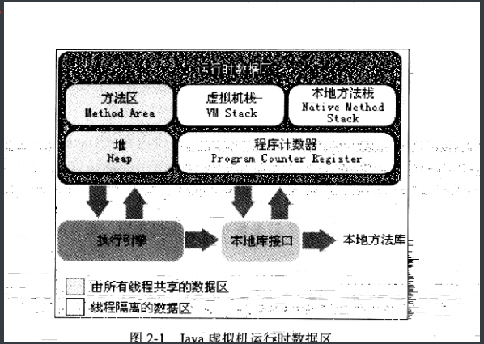

运行时数据区域

有一些是会随着虚拟机的启动而创建,随着虚拟机的退出而销毁.另一些于线程一一对应

虚拟机栈,本地方法栈,程序计数器,是线程私有的,方法区和堆是共享的

jvm线程:

1. 虚拟机线程
2. 周期任务线程
3. gc线程
4. 编译线程
5. 信号调度线程

 

程序计数器

是一个较小的内存空间,可以当作当前线程,字节码的行号指示器.字节码解释器工作是就是通过改变这个计数器的值来进行执行下一条指令,分支,循环,跳转,异常,线程恢复都是靠这个,每个线程有一个自己的计数器, 记录的是一个指令的地址,执行native 方法,值制空,

Java虚拟机栈.

每个方法执行的同时都会创建一个栈帧,用于存储局部变量表,操作数栈,动态链接,方法出口,调用到执行完,都是在虚拟机栈对应的入栈和出栈.

本地方法栈

虚拟机栈是为虚拟机执行Java方法(字节码)服务.本地方法,是为了使用到的native方法服务的.

